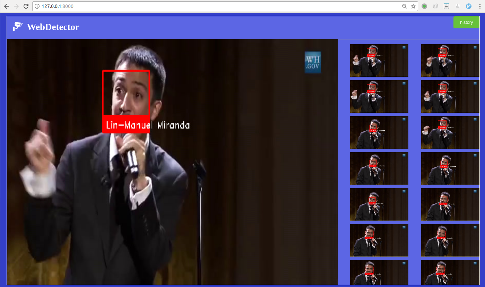
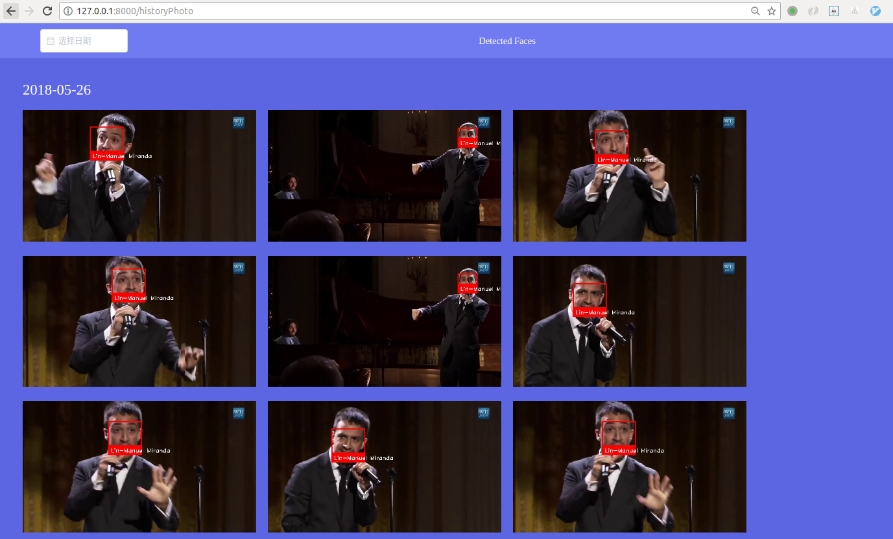

## WebDetector

### Application Scenarios
Streaming detected results in nearly real time to browser so that the managers of some facilities are able to access the monitoring view In any place through Internet or LAN.





### Environment
Make sure that the following pacages have been installed in your working machine

- FFServer
- twisted
- websocket-client
- OpenCV
- Django
- dlib
- face_recognition
- autobahn-python

### Quick Start
The project can be activated simply by running the following shell script, in this case, the stream that ffserver going to receive is from a video file, if you perfer face recognition from a camera, just change the argument in the last command line in `start.sh` from `facerec_from_video_file.py` to `webcam.py`
```shell
sh startup.sh
```

### Usage
After the ffserver started, a stream from a video file
or from a camera can be pushed to the server, and once the HTTP connection established, the front ground will pull and show the stream.
Acessing the result page in a different host is quite easy, just ensure that the machines as client and the server are under the same LAN, and just type a url as follows
```
http://serverIP:8000
```

### Advanced
WebDetector is just a way to show real-time stream through B/S, with Mask R-CNN, caffe2 and other libraries relative to DL, its usage can be extended.

